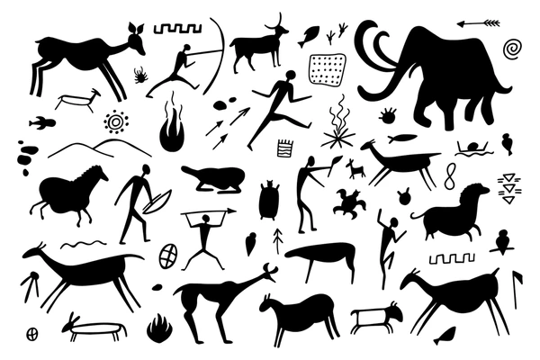
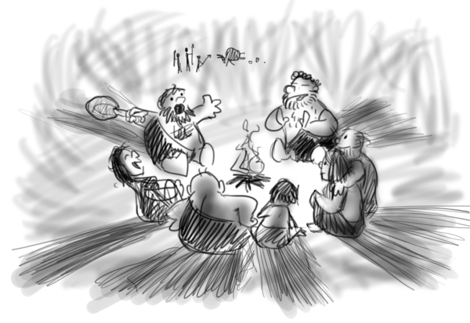
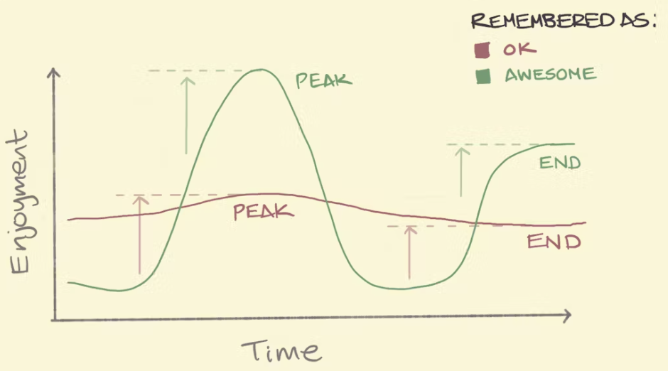
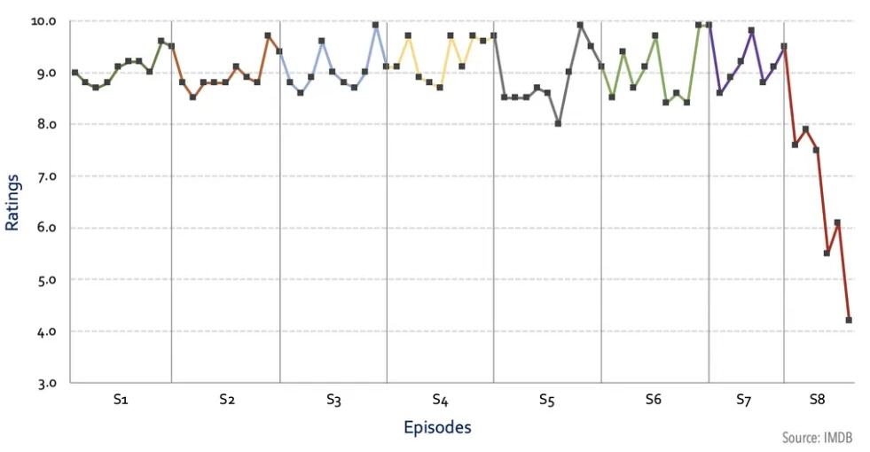
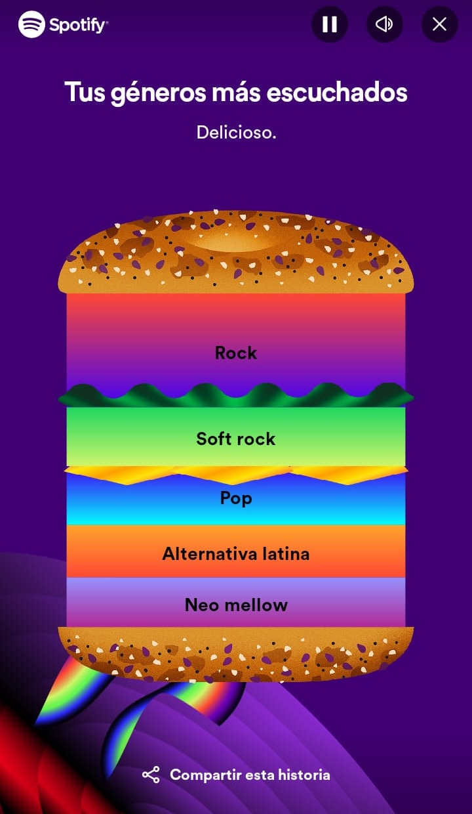
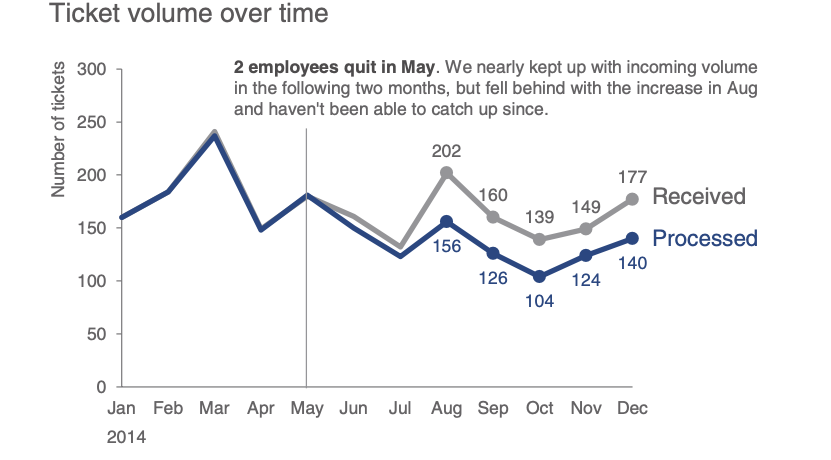
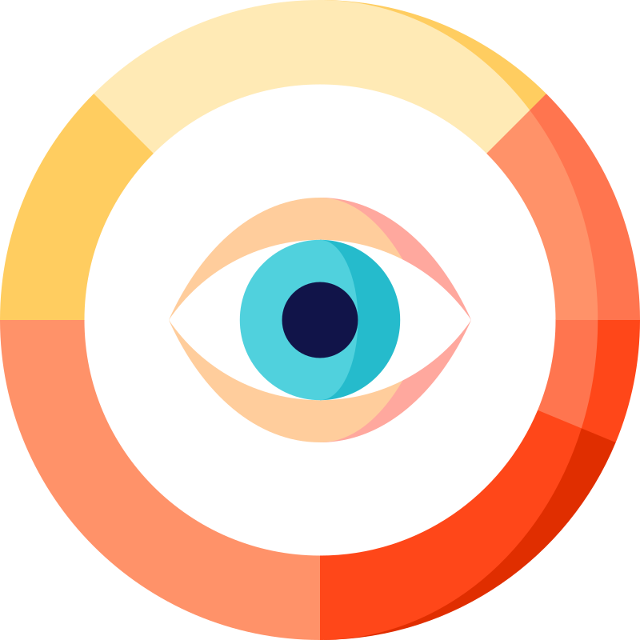
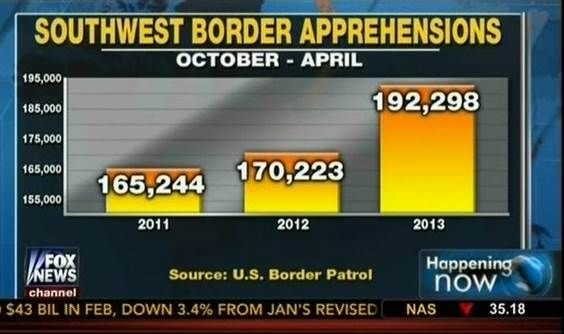
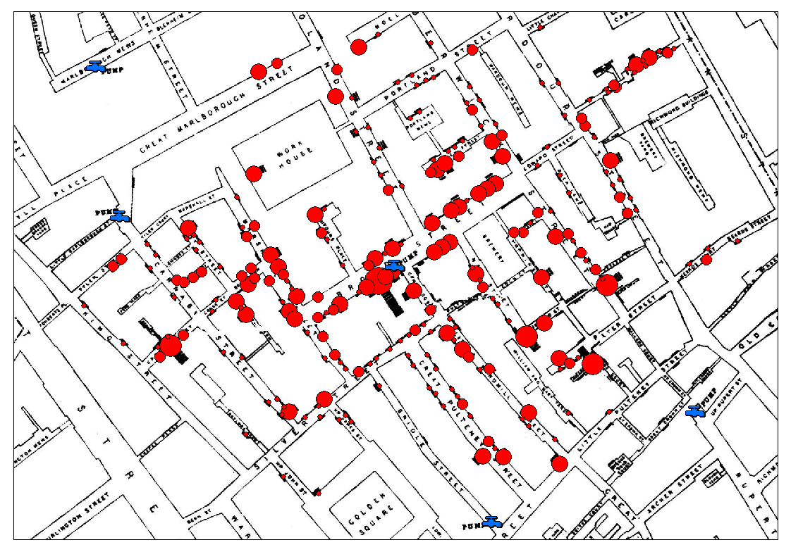

## Agenda {background-image="images/background.jpg" background-opacity="0.25"}
::: columns
::: {.column width="30%" .incremental}
* &#32;
* No
* Nope
* Jamás
:::
::: {.column width="70%" .fragment}
 
:::
:::

---

##  {background-image="images/background.jpg" background-opacity="0.25"}

<div style="display: flex; justify-content: center; align-items: center; height: 60vh; flex-direction: column; text-align: center;">
::: {.callout-note}
## Regla de Storytelling #1 
Nunca reveles el final antes de tiempo.  
[Siempre eleva la tensión y el dramatismo]{.fragment}
:::
</div>


---

## Agenda (v2)  {background-image="images/background.jpg" background-opacity="0.25"}
::: .incremental
1. Nunca reveles el [final]{style="background-color:black;"}
2. Los detalles son importantes, pero [no **todos** los detalles son importantes.]{style="background-color:black;"}
3. Tu primera versión será [horrible.]{style="background-color:black;"}
4. Muestra, no [cuentes.]{style="background-color:black;"}
:::


---

##  {background-image="images/background_slides3.png" background-opacity="0.3"}

<div style="display: flex; justify-content: center; align-items: center; height: 60vh; flex-direction: column; text-align: center;">
  [Data Storytelling]{style="font-size: 1em"}
  
  [¿Por qué Data Storytelling?]{style="font-size: 1.5em"}
</div>

---

## ¿Qué es el Storytelling? {background-image="images/background.jpg" background-opacity="0.25"}

::: columns

::: {.column width="50%"}
{fig-align="center" width="90%"}  
:::

::: {.column width="50%" .fragment}
{fig-align="center" width="100%"}  
:::
:::

. . .

::: {style="text-align: center; "}
🔥 Las **historias** son la primera tecnología humana
:::


---

## Esos cerebros tan hackables... {background-image="images/background.jpg" background-opacity="0.25"}

::: columns

::: {.column width="50%"}
{fig-align="center" width="90%"}  
*Regla del máximo y final (Peak-End Rule)*
:::

::: {.column width="50%" .fragment}
{fig-align="center" width="100%"}  
*Rating de Game of Thrones, por Kelvin Neo* 
:::

:::

---

## Narrativa {background-image="images/background.jpg" background-opacity="0.25"}

::: columns
::: {.column width="60%"}
<br><br>
Usar **trucos** de Storytelling (narrativa) para crear presentaciones que serán **recordadas** y que causarán **impacto**
:::
::: {.column width="40%" .fragment}
{fig-align="center"}
:::
:::

. . .

::: {style="text-align: center;"}
🎭 Las **emociones** generan acciones
:::

---

## El mejor ejemplo {background-image="images/background.jpg" background-opacity="0.25"}

::: columns
::: {.column width="30%" .fragment fragment-index=1}
{fig-align="center"}
:::
::: {.column width="40%" .center}
&#32;<br><br>
¿Podemos hacer que millones de personas compartan estadísticas en redes sociales?
:::
::: {.column width="30%" .fragment fragment-index=1}
{fig-align="center"}
:::
:::


--- 

##  {background-image="images/background.jpg" background-opacity="0.25"}

<div style="display: flex; justify-content: center; align-items: center; height: 60vh; flex-direction: column; text-align: center;">
::: {.callout-note}
## Regla de Storytelling #2 
Los detalles son importantes, 
[pero no **todos** los detalles son importantes.]{.fragment}
:::
</div>


---

## Ejemplos {background-image="images/background.jpg" background-opacity="0.25"}
::: columns
::: {.column width="50%"}
{fig-align="center"}
*🔢 No compartas números*
:::
::: {.column width="50%" .fragment}
{fig-align="center"}
*🪶Comparte una historia*
:::
:::

. . .


<br><br>
[(C) Storytelling with Data, por Cole Nussbaumer Knaflic.]{style="font-size: 0.75em; color: gray"}


---


##  {background-image="images/background.jpg" background-opacity="0.25"}

<div style="display: flex; justify-content: center; align-items: center; height: 60vh; flex-direction: column; text-align: center;">
::: {.callout-note}
## Regla de Storytelling #3
Tu primera versión **siempre** será horrible.
:::
</div>

---

## Ejemplos {background-image="images/background.jpg" background-opacity="0.25"}
::: columns
::: {.column width="50%"}
{fig-align="center"}
:::
::: {.column width="50%" .fragment}
{fig-align="center"}
:::
:::

. . .


::: {style="text-align: center;"}
🥱  1° versión $<$ ... $<$ 😊 última versión
:::


---

## Usar chatbots de IA para: {background-image="images/background.jpg" background-opacity="0.25"}
::: columns
::: {.column width="65%"}
<br>

* Plantillas personalizadas a medida
* Automatizar estructura del contenido
* Ahorro de tiempo en diseño
* Adaptación al estilo y preferencias

:::
::: {.column width="35%" .fragment}
{fig-align="center"}
:::
:::

---

## Usar chatbots de IA para: {background-image="images/background.jpg" background-opacity="0.25"}
::: columns
::: {.column width="60%"}
<br>

* Analogías y ejemplos
* Mejores traducciones
* Prompts para crear imágenes
* No busques imágenes, créalas!

:::
::: {.column width="40%" .fragment}
{fig-align="center"}
:::
:::

---


##  {background-image="images/background.jpg" background-opacity="0.25"}

<div style="display: flex; justify-content: center; align-items: center; height: 60vh; flex-direction: column; text-align: center;">
::: {.callout-note}
## Regla de Storytelling #4
[Explicar menos]{style="color: red"} y [mostrar más]{style="color: green"}
:::
</div>


---

## [Explicar menos]{style="color: red"} y [mostrar más]{style="color: green"}  {background-image="images/background.jpg" background-opacity="0.25"}

::: columns
::: {.column width="50%"}
<br>
{fig-align="center"}
:::
::: {.column width="50%" .fragment}
{fig-align="center"}
:::
:::


---

## Agenda (v2)  {background-image="images/background.jpg" background-opacity="0.25"}
::: .incremental
1. Nunca reveles el [**final**]{.fragment style="color:grey;"}
2. Los detalles son importantes, pero [no **todos** los detalles son importantes]{.fragment style="color:grey;"}
3. Tu primera versión será [**horrible**]{.fragment style="color:grey;"}
4. Muestra, no [**cuentes**]{.fragment style="color:grey;"}
:::

::: {.notes}
Opción 2: Una agenda misteriosa.
:::

---

##  {background-image="images/background_slides3.png" background-opacity="0.3"}

<div style="display: flex; justify-content: center; align-items: center; height: 60vh; flex-direction: column; text-align: center;">
[Visualización]{style="font-size: 1em"}

[¿Qué es la Visualización?]{style="font-size: 2em"}
</div>


---

## Visualización... {background-image="images/background.jpg" background-opacity="0.25"}


::: columns
::: {.column width="60%"}
<br>

La visualización de datos transforma información en gráficos para facilitar su comprensión. 

:::
::: {.column width="40%" .fragment}
{fig-align="center"}
:::
:::

---


## Ejemplos {background-image="images/background.jpg" background-opacity="0.25"}

::: columns
::: {.column width="50%" style="text-align: center;"}
{fig-align="center" width="100%"}

*❌ Mal Gráfico*
:::
::: {.column width="50%" .fragment style="text-align: center;"}
{fig-align="center" width="80%"}

*✅ Buen Gráfico*
:::
:::

## Cuarteto de ANSCOMBE {background-image="images/background.jpg" background-opacity="0.25"}
::: columns
::: {.column width="50%" style="text-align: center;" }
{fig-align="center" width="80%"}
:::
::: {.column width="50%" .fragment style="text-align: center;" }
<br>
{fig-align="center" width="100%"}
:::
:::

::: {style="text-align:center" .fragment}
📋 Tablas vs 📊 Gráficos
:::

---

### Datasaurus {background-image="images/background.jpg" background-size="cover" background-opacity="0.5"}

{width=80%}

---

## Teoría de visualización {background-image="images/background.jpg" background-opacity="0.25"}

{fig-align="center" width="90%"}

---

## 4 Pilares Visualización -  Noah Iliinsky {background-image="images/background.jpg" background-opacity="0.25"}

::: columns
::: {.column width="60%" .fragment}
<br>

1. **Propósito**: Define la meta.
2. **Contenido**: Datos relevantes.
3. **Estructura**: Organización clara.
4. **Formato**: Gráfico adecuado.

:::
::: {.column width="40%" }
{fig-align="center"}
:::
:::

##  {background-image="images/background_slides3.png" background-opacity="0.3"}

<div style="display: flex; justify-content: center; align-items: center; height: 60vh; flex-direction: column; text-align: center;">
[Herramientas]{style="font-size: 1em"}

[Herramientas de Visualización en Python]{style="font-size: 2em"}
</div>


---

## Exploración de Datos {background-image="images/background.jpg" background-opacity="0.25"}

. . .

{width=400 style="box-shadow: 0 4px 8px 0 rgba(0, 0, 0, 0.2), 0 6px 20px 0 rgba(0, 0, 0, 0.19)"}

. . .

{.absolute top=125 left=25 width=800 style="box-shadow: 0 4px 8px 0 rgba(0, 0, 0, 0.2), 0 6px 20px 0 rgba(0, 0, 0, 0.19);"}

. . .

{.absolute top=150 left=50 width=800 style="box-shadow: 0 4px 8px 0 rgba(0, 0, 0, 0.2), 0 6px 20px 0 rgba(0, 0, 0, 0.19);"}

. . .

[¡Demasiadas opciones! <br> El usuario no puede ser responsable de encontrar lo valioso.]{ style="background-color: #fff" }

---

## Tipos de Gráficos Esenciales {background-image="images/background.jpg" background-opacity="0.25"}


<div style="display: grid; grid-template-columns: repeat(3, 1fr); gap: 10px;">

 


</div>

. . .

[(C) Essential chart types for data visualization, por Atlassian.]{style="font-size: 0.75em; color: gray"}


---

## Librerías para Graficar  {background-image="images/background.jpg" background-opacity="0.25"}

::: columns
::: {.column width="60%" .fragment .incremental}
¡Explora estas poderosas librerías de visualización en Python!

* **Vieja confiable**: [Matplotlib](https://matplotlib.org/)
* **Populares**: [Seaborn](https://seaborn.pydata.org/), [Plotly](https://plotly.com/python/), [Altair](https://altair-viz.github.io/)
* **Otras**: [plotnine](https://plotnine.readthedocs.io/), [pygal](http://www.pygal.org/), [Bokeh](https://docs.bokeh.org/en/latest/)
:::
::: {.column width="40%" .fragment}
{fig-align="center"}
:::
:::

. . .

::: {style="text-align:center"}
📊 Elige una y domínala!
:::

---

## 📊 Ejemplos  {background-image="images/background.jpg" background-opacity="0.25"}

```{pyodide-python}
import matplotlib.pyplot as plt
x = ['A', 'B', 'C', 'D', 'E']
y = [5, 7, 3, 8, 4]
plt.figure(figsize=(6, 3))  
plt.bar(x, y, color='blue') 
plt.title("Gráfico de Barras")
plt.show()
```

---

## 📊 Ejemplos  {background-image="images/background.jpg" background-opacity="0.25"}

```{pyodide-python}
import matplotlib.pyplot as plt
x = [1, 2, 3, 4, 5]
y = [2, 4, 6, 8, 10]
plt.figure(figsize=(6, 3)) 
plt.plot(x, y, marker='o', color='blue')
plt.title("Gráfico de Puntos")
plt.show()
```

---

## 📊 Ejemplos  {background-image="images/background.jpg" background-opacity="0.25"}

```{pyodide-python}
import matplotlib.pyplot as plt
import numpy as np
data = np.array([[1, 2, 3], [4, 5, 6], [7, 8, 9]])
plt.figure(figsize=(6, 3))  # Tamaño del gráfico
plt.imshow(data, cmap='Blues', interpolation='nearest')
plt.colorbar()
plt.title("Gráfico Heatmap")
plt.show()
```

---

## Dashboards en Python {background-image="images/background.jpg" background-opacity="0.25"}


<br>
[https://github.com/sebastiandres/streamlit_slides]{style="font-size: 0.5em; color: gray"}

---


---

## Dashboards en Python {background-image="images/background.jpg" background-opacity="0.25"}

::: columns
::: {.column width="60%"}
&#32;<br><br>

[Streamlit-Slides]{style="font-size: 1em; color: gray"}

Tu presentación es una página web
:::
::: {.column width="40%" .fragment}

:::
:::

---

## 🎉 ¡Gracias por Participar!  {background-image="images/background.jpg" background-opacity="0.25"}

::: {.columns}
:::: {.column width=50%}
<br>

❓¿Preguntas?

👏 Responder [encuesta](https://docs.google.com/forms/d/e/1FAIpQLSdvkmAfsYiiuVhJdjyWSgH3cr-8jZwWYMHWGsVBPG6NcvBd-A/viewform?usp=sf_link)


🥳 Gracias de Nuevo 
  
::::
:::: {.column width=50% align="center"}
{width=400}
::::
:::

> 🔗 Nuestro Sitio Web: [seth-nut.github.io/resources](https://seth-nut.github.io/resources/).
